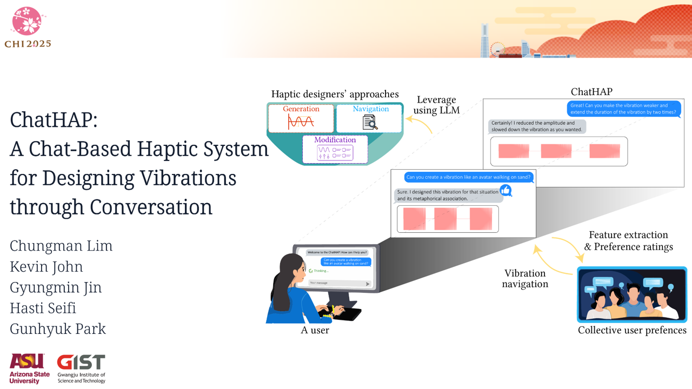
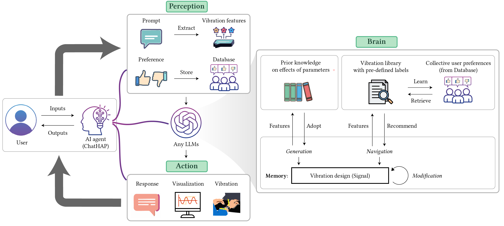

# ChatHAP

ChatHAP is a conversational system for designing haptic vibrations. It integrates various haptic design approaches using a large language model, allowing users to generate vibrations from signal parameters, navigate libraries, and modify existing designs—all through natural language interaction.

## Paper

### ChatHAP: A Chat-Based Haptic System for Designing Vibrations through Conversation (CHI2025)
[](https://youtu.be/5tHNRJuSp1Q)
[Click here to watch the YouTube video](https://youtu.be/5tHNRJuSp1Q)


### Implementation


ChatHAP functions as an AI agent that interacts with users by perceiving their inputs, designing vibrations, and selecting actions to provide as outputs.
ChatHAP receives user prompts and collects preferences on its actions.
The system then designs vibrations using one of three design approaches based on the vibration features extracted by an LLM.
Finally, ChatHAP responds by sending a message, visualizing a signal plot, and/or conveying a vibration through a haptic device.
Through interaction with this conversational agent, users can design and refine haptic signals using natural language.


## Getting Started  

### 1. Set up the environment  
Create and activate the Conda environment:  
```bash
conda env create -f environment.yml
conda activate ChatHAP
```
### 2. Run the ChatHAP server
```bash
streamlit run app/main.py
```


# Troubleshooting
No currently known issues.


# Publication
Please cite this paper if you use this ChatHAP repository in your research.

Chungman Lim, Kevin John, Gyungmin Jin, Hasti Seifi, and Gunhyuk Park. 2025. 
ChatHAP: A Chat-Based Haptic System for Designing Vibrations through Conversation.
In CHI Conference on Human Factors in Computing Systems (CHI ’25),
April 26-May 1, 2025, Yokohama, Japan. ACM, New York, NY, USA, 18 pages. 
https://doi.org/10.1145/3706598.3713441


```
TBA

author = {Lim, Chungman and John, Kevin and Jin, Gyungmin and Seifi, Hasti and Park, Gunhyuk},
title = {ChatHAP: A Chat-Based Haptic System for Designing Vibrations through Conversation},
year = {2025},
doi = {10.1145/3706598.3713441}
```
